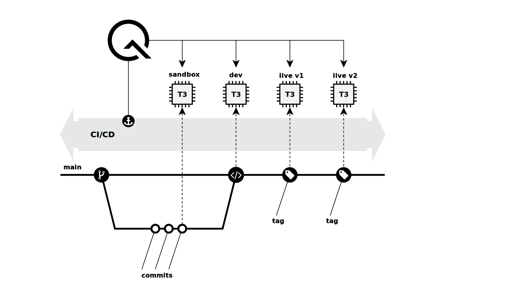
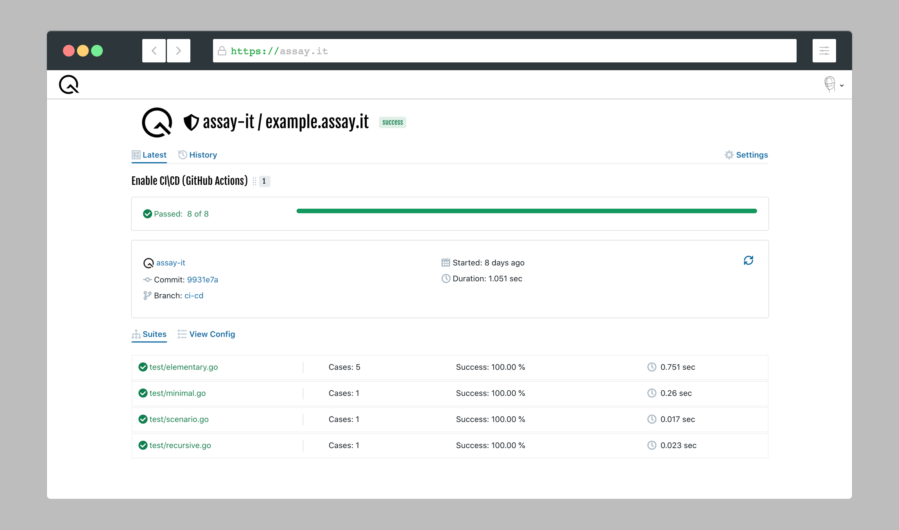

# Everything is Continuous

1. TOC
{:toc}


Modern software engineering is talking about Continuous Integration, Continuous Delivery and Continuous Deployment. Why should we distinguish them? **"Everything is Continuous"** defines a right philosophy and commitment that ensures the always ready state of your code. It also implements pipelines to deploy every commit straight to sandbox with the following promotion to production. We have discussed this workflow in our [blog post](/2020/07/01/Everything-is-Continuous.html).

**"Everything is Continuous"** does not invent any special workflow. It just emphasizes deployment and quality assessment as a key feature along the development process. Continuous proofs of the quality helps to eliminate defects at earlier phases of the feature lifecycle. It impacts on engineering teams philosophy and commitments, ensuring that your microservice(s) are always in a release-ready state. The right implementation of the workflow deploys every commit to disposable sandbox environment with the following promotion to production.

Let's consider the workflow implementation with GitHub Actions and AWS CDK, [https://assay.it](https://assay.it) executes quality assessments along the pipeline.



1. The `main` branch of your project is always the latest deployable snapshot of a microservice.

2. The feature integration into `main` branch is implemented through pull request (branching or forking).

3. GitHub Actions executes quality check and consequent pull request deployment to the sandbox environment every time new changes are proposed (each commit). The sandbox environment is a disposable deployment dedicated for pull request validation.  

4. Once the sandbox environment is ready, the quality assessment begins.

5. [https://assay.it](https://assay.it) executes your Behavior as a Code definition against sandbox environment.

6. Everything is alright, the pull request is merged to the `main` branch.

7. The merge of pull request triggers the deployment of the `main` branch into the development environment. 

8. [https://assay.it](https://assay.it) make a formal proof of the development environment.

9. The delivery of the development environment to live is automated using git tags. A provisioning of a new tag caused a new immutable deployment of your application to live environment.

10. [https://assay.it](https://assay.it) make a formal proof of the live environment.


[View it on GitHub](https://github.com/assay-it/example.assay.it){: .btn .fs-5 .mb-4 .mb-md-0 }

GitHub Actions anchors [https://assay.it](https://assay.it) though WebHook API. Results of quality assessment are communicated back to Pull Request (each commit is annotated) and details are visible at service itself.



The workflow implementation requires the following pipelines for GitHub Actions at `.github/workflows`
* `check.yml` checks the quality of proposed changes. It is executed for each pull request and its commits.
* `build.yml` validates the quality of `main` branch after changes are merged.
* `carry.yml` carries the microservice to the live environment using immutable deployment. The pipeline is executed every time a new release is crafted using GitHub.


## Project layout

"How do I organize my code?" is one of the important questions to resolve in the beginning of development. Unfortunately, there is not a straightforward answer on it that suits each team. Based on our experience with heterogeneous development (AWS CDK, TypeScript and other runtime), the following structure simplify maintenance:

```
 /
 ├── .github/workflows
 |   └── ...yml // definition of GitHub Action pipelines
 ├── cloud
 |   └── ...ts  // Infrastructure as a Code
 ├── test
 |   └── ...go  // Behavior as a Code, quality assessment
 ├── .assay.json
...
```

## Check It

Let's define the `.github/workflows/check.yml` pipeline to prove quality of proposed changes with [https://assay.it](https://assay.it).

We **trigger** the pipeline when a new pull request is created or new changes are committed to existing one.

```yml
name: check
on:
  pull_request:
    types:
      - opened
      - synchronize
```

Usually pipelines contain a lot of various build, compile, lint and unit tests. We are going to omit them because they are language/runtime dependent. Please see [our example on GitHub](https://github.com/assay-it/example.assay.it) about Golang. Let's jump directly to continuous deployment and quality assessment.

Before anythings happens with deployment, we need to configure **access to AWS**. We are using [official aws action](https://github.com/aws-actions/configure-aws-credentials).


```yml
- name: aws access
  uses: aws-actions/configure-aws-credentials@v1
  with:
    aws-access-key-id: ${{ secrets.AWS_ACCESS_KEY }}
    aws-secret-access-key: ${{ secrets.AWS_SECRET_KEY }}
    aws-region: eu-west-1
```


This action just injects credentials into the pipeline's environment. You still have to create an IAM User, generate access/secret keys and configure GitHub secrets variables. Fortunately, you do this manual toil only once per GitHub repository.

**Infrastructure as a Code** is one approach to implement deployment automation for your microservices. This reference workflow uses **declarative IaC** with AWS CDK. It describes the infrastructure using TypeScript without explicit definition of commands to be performed. AWS CDK transpile the TypeScript to AWS Cloud Formation. Because of **immutable deployment**, we deploy each pull request to own a sandbox. The variable `github.event.number` is a perfect source to derived unique name for sandbox environment


```yml
- name: deploy
  run: |
    npm -C cloud install
    npm -C cloud run \
      cdk -- deploy example-pr${{ github.event.number }} \
        -c vsn=pr${{ github.event.number }}
```


Once the sandbox environment is ready, the quality assessment begins. GitHub Actions anchors [https://assay.it](https://assay.it) though WebHook API. We have implemented an action [assay-it/github-actions-webhook](https://github.com/assay-it/github-actions-webhook) to trigger quality assessment for you:


```yml
- uses: assay-it/github-actions-webhook@latest
  with:
    secret: ${{ secrets.ASSAY_SECRET_KEY }}
```


This action requires a secret key to execute WebHook on your behalf. You can generate a new secret key from [https://assay.it](https://assay.it): Account > Setting > Secrets.

This is it! The quality assessment pipeline is ready! Make any changes to your microservice and open a pull request. Enjoy the results!

## Built It

Let's define the `.github/workflows/build.yml` pipeline to validates the quality of the `main` branch after changes are merged with [https://assay.it](https://assay.it).

We **trigger** the pipeline when `main` branch is updated (e.g. merge of pull request).

```yml
name: build
on:
  push:
    branches:
      - main
      - /refs/heads/main
```

Otherwise, the build pipeline is similar to the previous one. You assemble artifacts, deploy them to the development environment and trigger a quality assessment process. Only one noticeable difference, the branch is always deployed to the same environment (e.g. `latest`).


```yml
- name: deploy
  run: |
    npm -C cloud install
    npm -C cloud run \
      cdk -- deploy example-latest \
        -c vsn=latest
```


## Carry It

Let's define the `.github/workflows/carry.yml` pipeline to spawn a new immutable live environment every time a new release is crafted.

GitHub Releases is a very handy feature to automate live development.

```yml
name: carry
on:
  release:
    types: [published]
```

The release name `github.event.release.name` helps you to distinguish deployments and manage production traffic.


```yml
- name: deploy
  run: |
    npm -C cloud install
    npm -C cloud run \
      cdk -- deploy example-${{ github.event.release.name }} \
        -c vsn=${{ github.event.release.name }}
```



## Afterwords

This simple workflow delivers few measurable benefits to your team:

* **Reduce Cost** by eliminating toil activities from engineering processes. Team focuses their effort towards feature development and other business valuable activities. By coding the entire delivery chain, the team accomplishes automated and repeatable processes. 

* **Increase Speed** of iteration cycles. It shortens delivery time and unlocks an opportunity to release software at any point in time.

Please admit that this skips definition of actual quality assessment suites. Please check [the core](/docs/core) module for details about Behavior as a Code development or see [our example on GitHub](https://github.com/assay-it/example.assay.it).
